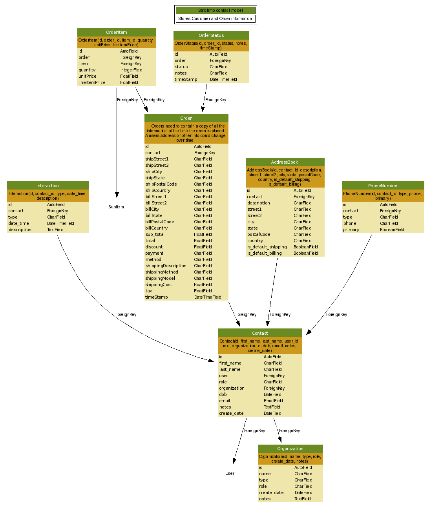
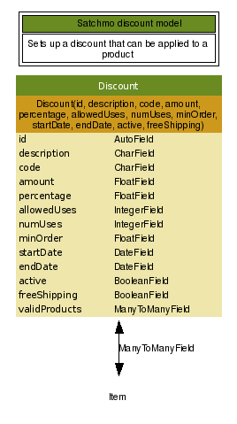
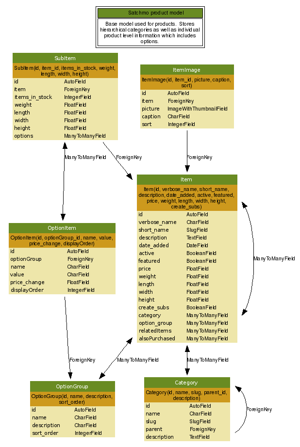
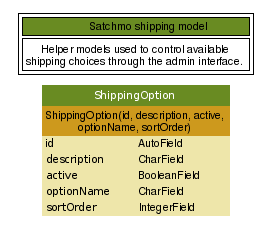
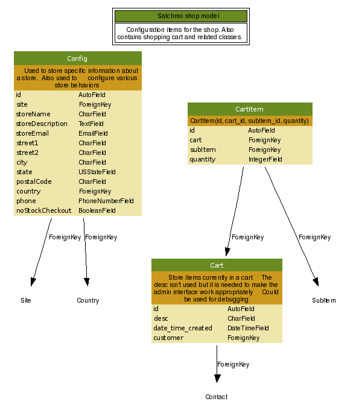

=====================
Satchmo documentation
=====================

.. contents:: Table of Contents
    
Introduction
------------

History
~~~~~~~
Like most Open Source projects, Satchmo was started to "scratch an itch."  This
particular itch was to create a framework for developing shopping cart software
using the Django framework.  After a little bit of discussion on the Django list, 
we created our own project in April 2006.

Project Mission
~~~~~~~~~~~~~~~
Satchmo's mission is to use Django to create an open source framework for creating 
unique and robust online stores. To provide maximum flexibility, Satchmo is licensed 
under the BSD license.

Features
~~~~~~~~
Satchmo is built using the Django framework.  Using this framework has a number 
of advantages for building an online shopping site.  Some of them include:

-   A built in Object-relational mapper makes it easy to create and/or modify our 
    models and have the underlying database created for you.  The ORM also makes it 
    easy to make simple references to complex relationships without being an SQL 
    expert.  If you need to drop down to SQL you can.
-   An automatic admin interface makes it easy for you to get up and running 
    quickly and see all the data in an easy to use set of forms.  The permission 
    system also allows you to give selective access to different people on your 
    team.
-   Flexible URL design that is helpful for making your site look professional 
    and show up well in search engines.
-   Powerful template system that allows you to configure every aspect of your 
    site.  The included reference implementation shows you a very basic site but 
    with Django's template you can easily make your site as unique and complex as 
    you'd like.
-   Proven performance including a robust caching system.  This is one of the 
    most critical aspects of an online store.  If you make it big and realize your 
    old site can't handle the load, you're in a difficult place.
-   Security is also a primary component for any online site these days.  
    Django's session management capabilities makes it more secure by not encoding 
    session ID's in urls so that session-ID theft is not possible via the "Referrer" header.  
    Also, Django takes care of escaping SQL statements so that SQL injection attacks are    
    not possible.
-   Robust internationalization support in all phases of a project allow you to 
    tailor your site to different countries and languages.

Django clearly sets Satchmo up to be a robust framework for your store.  The 
Satchmo framework is still in it's early stages but already provides a number 
of very sophisticated features.  Some highlights include:

-   A robust customer model that allows you to maintain unlimited addresses for 
    each of your customers as well as customer specific notes and information.
-   Customer orders can have multiple statuses so it's easy for you to track your 
    interactions
-   A full localization model that is pre-loaded with over 250 countries and 
    information about their subdivisions including states, counties or other 
    divisions.
-   An extremely flexible category model that allows you to have deeply nested 
    categories to help your users find products quickly.
-   A sophisticated product model that allows you to describe and categorize the 
    products as well as link them to related products.  You can feature certain 
    products and store item dimensions in order to use for product shippping.  You 
    can also associate as many product options (sizes, colors, etc) with a product 
    and manage them in a very simple way.  This feature allows you to manage a 
    large number of unique products without a lot of very time consuming steps.  
    Each of these unique items can have price changes or other configurable changes 
    based on your needs.
-   Products also have the capability to have multiple images associated with 
    them.  Each image is automatically scaled to a thumbnail size of your choosing 
    and is automatically cached for maximum performance.
-   Support for Authorize.net

Models are currently in place to allow additional shipping and payment options 
as well as flexibly discount options.

Current Development Status
~~~~~~~~~~~~~~~~~~~~~~~~~~
Satchmo is currently in alpha status.  Many functions work but there is still a lot
of change in the underlying api.

Requirements
------------
Satchmo is based on the Django framework, therefore you do need a fully functioning 
Django instance to use Satchmo.  The Django installation guide will step you 
through the process - http://www.djangoproject.com/documentation/install/

There are a number of other Python packages that are required for usage of all the 
features in Satchmo.

- Python Imaging Library
- Elementtree (included in Python 2.5+)
- Python cryptography toolkit
- Reportlab

Installation
------------
This guide assumes that Django is properly installed and that you have installed the
dependencies mentioned in the Requirements section.

Basic Configuration
-------------------

Site Configurations
~~~~~~~~~~~~~~~~~~~

Loading Data
~~~~~~~~~~~~

Setting up your store
---------------------

Framework design
----------------

Models
~~~~~~
The following diagrams show all of the current models, their data elements and their relationships.

Contact
+++++++

Discount
++++++++

Payment
+++++++
.. image:: payment.gif

Product
+++++++

Shipping
++++++++

Shop
++++

Supplier
++++++++
.. image:: supplier.gif

Thumbnails
++++++++++

Templates
~~~~~~~~~

Roadmap
-------

